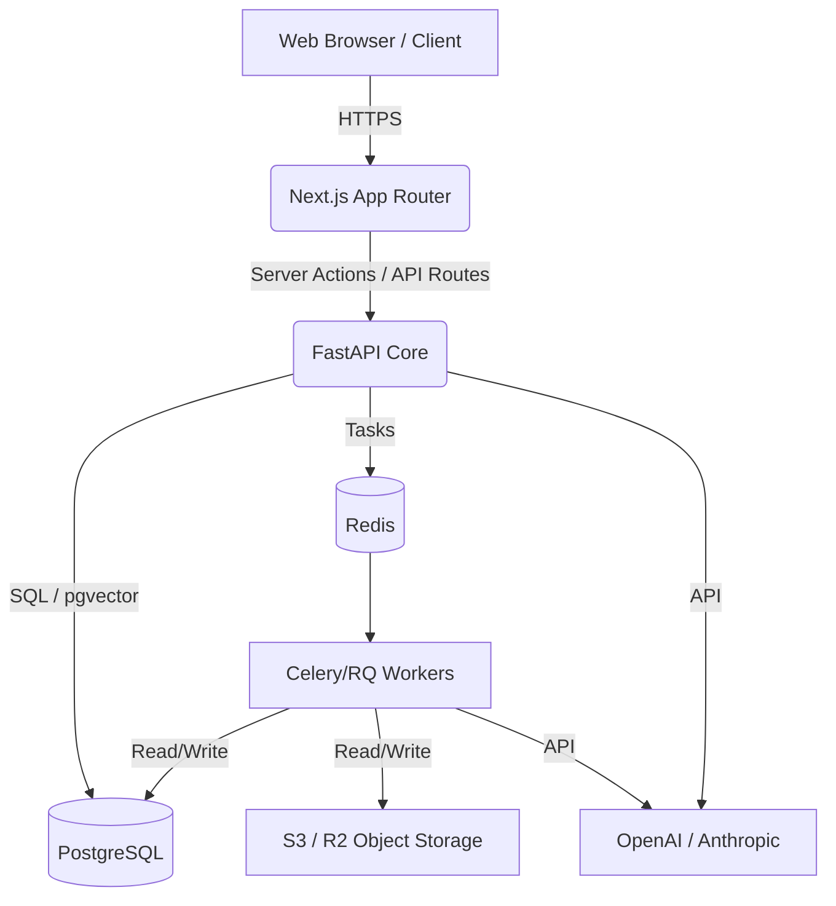

# System Architecture

The AI Document Intelligence Platform uses a **modern, decoupled, full-stack architecture** designed for high scalability, rapid iteration, and strict separation of concerns.

## High-Level Topology

The system is divided into three primary layers:

1. **Client Layer (Next.js Monorepo)**: Handles all user interfaces, rendering, and edge routing.
2. **Core API Layer (FastAPI)**: Handles business logic, AI orchestration, and synchronous data access.
3. **Data & Worker Layer**: Handles asynchronous processing, persistent storage, and background jobs.

## 1. Monorepo Structure (Turborepo)

We utilize **Turborepo** with `pnpm` workspaces to manage our frontend applications and shared packages. We strictly follow **Feature-Sliced Design (FSD)** principles for our packages.

### Applications (`apps/`)
- `apps/web`: The public-facing marketing website.
- `apps/app`: The authenticated SaaS application where users manage documents and chat.
- `apps/admin`: The internal back-office application for system monitoring and moderation.
- `apps/api`: The Python FastAPI backend (co-located in the monorepo for ease of development, but deployed independently).

### Shared Packages (`packages/`)
- `@workspace/ui`: Shared UI components (shadcn/ui, Radix).
- `@workspace/data`: Shared data fetching hooks (TanStack Query) and state management (Zustand).
- `@workspace/types`: Shared TypeScript definitions that mirror the FastAPI Pydantic schemas.
- `@workspace/auth`: Shared authentication logic.
- `@workspace/observability`: Shared monitoring and analytics (PostHog, Sentry).
- `@workspace/email`: Shared email sending capabilities.

## 2. Backend Architecture (FastAPI)

The backend is built with **FastAPI** for its exceptional performance, async capabilities, and native Pydantic validation.

### Layered Architecture

The backend strictly separates HTTP concerns from business logic:
- **Routers (`api/`)**: Define HTTP endpoints, dependencies, and response models. No business logic belongs here.
- **Services (`services/`)**: The core business logic. Services take Python types, perform operations, and return Python types. They do not know about HTTP requests or responses.
- **Data Access (`crud/`)**: The persistence layer. Isolates SQLAlchemy operations from the services.
- **Schemas (`schemas/`)**: Pydantic models for validation.
- **Models (`models/`)**: SQLAlchemy models for database mapping.

### Asynchronous Design

The system relies heavily on asynchronous processing to ensure the API remains responsive.
- Document parsing, chunking, and embedding generation are **never** performed synchronously in an API request.
- They are offloaded to **Redis-backed workers** (e.g., Celery or RQ) immediately upon upload.

## 3. Storage Architecture

### Relational Database
- **PostgreSQL**: The primary source of truth for users, sessions, documents, conversations, and jobs.
- **pgvector**: An extension for PostgreSQL that allows us to store and query highly dimensional vector embeddings directly alongside our relational data, enabling hybrid search and strict row-level security (tenant isolation).

### Object Storage
- **S3-Compatible Storage (AWS S3 / Cloudflare R2)**: Used to store raw PDF, DOCX, and TXT files securely. The database only stores references (URLs/keys) to these objects.

### Cache & Message Broker
- **Redis**: Serves as the message broker for background jobs, rate-limiting counters, and short-term caching.